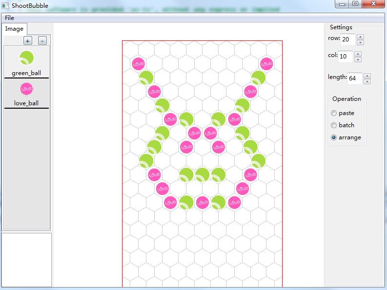

#How to create Shoot Bubble editor by drag2d

##Preview

##Resource

[shootbubble.exe]()

[Shoot Bubble editor project](https://github.com/xzrunner/shootbubble)

[drag2d project](https://github.com/xzrunner/drag2d)

##1. Library Panel
The editor need to load ball's image. In `Tack.cpp` by these codes

	library = context->library = new d2d::LibraryPanel(leftHorizontalSplitter);
	context->library->addPage(new d2d::LibraryImagePage(context->library->getNotebook()));

You can use LibraryPanel's `addPage()` to add many kind symbol's list for loading, such as mesh symbol, shape symbol, combined symbol. This editor only need image symbol, you can create list by `LibraryImagePage`.

##2. Property Panel
The default `PropertySettingPanel` is enough. In `Tack.cpp`

	property = context->property = new d2d::PropertySettingPanel(leftHorizontalSplitter);

##3. Stage Panel

##4. Toolbar Panel